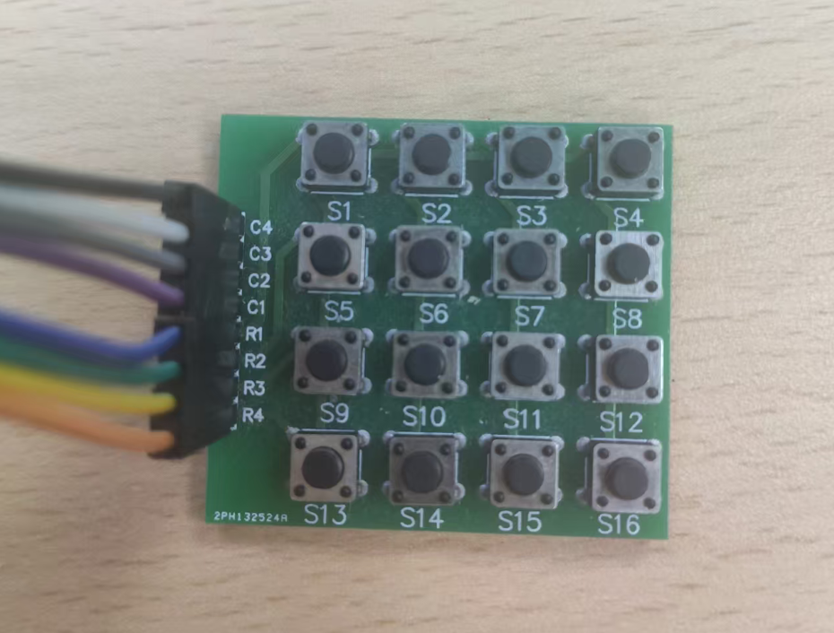
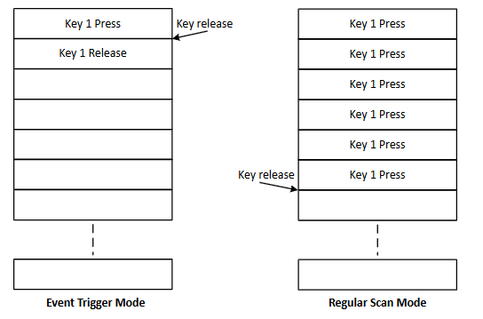

* [English Version](./README.md)

### Ameba RTL8721Dx 系列 SoC：key_scan_regular_scan_demo（Raw API，FreeRTOS）

🚀 本示例基于 RTL8721Dx 系列 SoC 的 Key-Scan 外设，演示了一个 **4×4 键盘矩阵** 在 **常规扫描模式（regular scan mode）** 下的按键检测方式，使用 Raw API 实现。

- 📎 开发板购买链接：[🛒 淘宝](https://item.taobao.com/item.htm?id=904981157046) | [📦 Amazon](https://www.amazon.com/-/zh/dp/B0FB33DT2C/)
- 📄 [芯片详情](https://aiot.realmcu.com/cn/module/index.html)
- 📚 [Key-Scan 文档](https://aiot.realmcu.com/cn/latest/rtos/peripherals/key_scan/index.html)

---

### ✨ 功能特点

✅ 使用 4×4 按键矩阵  
✅ **常规扫描模式**：  
   - 只记录**按键按下事件**（按下时写入 FIFO，松开时不再重复记录）  
   - 某个键保持按下期间，其按下事件会一直保留在 FIFO 中，直到松开后被系统检测、处理  

✅ 支持多键检测：最多可同时按下 **6 个按键**  
✅ 提供 4×4 键盘矩阵引脚定义和对比示意图，方便硬件连线与理解  

#### 4×4 键盘矩阵引脚定义



行（Row）：

| 行号 | 引脚  |
|------|-------|
| Row 1 | PA31 |
| Row 2 | PA30 |
| Row 3 | PA29 |
| Row 4 | PA28 |

列（Column）：

| 列号 | 引脚  |
|------|-------|
| Col 1 | PB17 |
| Col 2 | PB18 |
| Col 3 | PB20 |
| Col 4 | PA14 |

---

### 🧠 工作原理

- Key-Scan 外设通过轮询行、列引脚的方式检测按键矩阵状态变化。  
- 当检测到按键按下或松开时，会产生中断，并将事件写入 FIFO。  
- 本示例采用 **常规扫描模式（regular scan mode）**：  
  - 应用线程从 FIFO 中读取键值，并根据行、列编码解析具体按键位置；  
  - 与 **事件触发模式（event trigger mode）** 不同，此模式偏向“持续扫描 + 按下态记录”。  
- 详细原理请参考 SDK 文档 Key-Scan 章节：  
  📚 [Key-Scan 文档](https://aiot.realmcu.com/cn/latest/rtos/peripherals/key_scan/index.html)

- 常规扫描模式 vs. 事件触发模式 差异示意：  
  

---

### 🚀 快速开始

1️⃣ **选择并配置 SDK 环境**

- 设置 `env.sh`（或 `env.bat`）路径：

  ```bash
  source {sdk}/env.sh
  ```

- 将 `{sdk}` 替换为 [ameba-rtos SDK](https://github.com/Ameba-AIoT/ameba-rtos) 根目录中 `env.sh` 的绝对路径。  
- 若 SDK 路径未变，此步骤只需执行一次。

⚡ **注意**：本示例仅支持 SDK 版本 **≥ v1.2**

2️⃣ **编译工程**

在本示例根目录（例如当前 demo 目录或 `HELLO_WORLD`）执行：

```bash
source env.sh
ameba.py build -p
```

3️⃣ **烧录到开发板**

⚡ **注意**：本项目目录中已提供预编译的 bin 文件，可直接烧录：

```bash
ameba.py flash --p COMx --image km4_boot_all.bin 0x08000000 0x8014000 --image km0_km4_app.bin 0x08014000 0x8200000
```

> 如需使用上一级目录的 bin 文件，可根据实际路径进行修改后再烧录。

4️⃣ **打开串口监视器**

```bash
ameba.py monitor --port COMx --b 1500000
```

> 将 `COMx` 替换为实际串口号，例如 `COM5`。

5️⃣ **按键测试**

- 按下 / 松开 4×4 键盘矩阵上的按键；  
- 在串口终端中观察按键事件输出（包含行、列信息等）；  
- 可结合“常规扫描 vs 事件触发模式示意图”理解日志与模式差异。

6️⃣ **观察日志输出** 📜  

- 参考下方“日志示例”，确认 Key-Scan 初始化和中断事件是否正常工作。

---

### 📝 日志示例

```bash
日志示例：
14:45:24.474  ROM:[V1.1]
14:45:24.474  FLASH RATE:1, Pinmux:1
14:45:24.474  IMG1(OTA1) VALID, ret: 0
14:45:24.474  IMG1 ENTRY[f800779:0]
14:45:24.474  [BOOT-I] KM4 BOOT REASON 0: Initial Power on
14:45:24.474  [BOOT-I] KM4 CPU CLK: 240000000 Hz
14:45:24.474  [BOOT-I] KM0 CPU CLK: 96000000 Hz
14:45:24.474  [BOOT-I] PSRAM Ctrl CLK: 240000000 Hz 
14:45:24.474  [BOOT-I] IMG1 ENTER MSP:[30009FDC]
14:45:24.474  [BOOT-I] Build Time: Mar  2 2026 14:41:35
14:45:24.474  [BOOT-I] IMG1 SECURE STATE: 1
14:45:24.490  [FLASH-I] FLASH CLK: 80000000 Hz
14:45:24.490  [FLASH-I] Flash ID: 85-20-16 (Capacity: 32M-bit)
14:45:24.490  [FLASH-I] Flash Read 4IO
14:45:24.490  [FLASH-I] FLASH HandShake[0x2 OK]
14:45:24.490  [BOOT-I] KM0 XIP IMG[0c000000:82c0]
14:45:24.490  [BOOT-I] KM0 SRAM[20068000:860]
14:45:24.490  [BOOT-I] KM0 PSRAM[0c008b20:20]
14:45:24.490  [BOOT-I] KM0 ENTRY[20004d00:60]
14:45:24.490  [BOOT-I] KM4 XIP IMG[0e000000:18800]
14:45:24.490  [BOOT-I] KM4 SRAM[2000b000:480]
14:45:24.490  [BOOT-I] KM4 PSRAM[0e018c80:20]
14:45:24.490  [BOOT-I] KM4 ENTRY[20004d80:40]
14:45:24.490  [BOOT-I] IMG2 BOOT from OTA 1, Version: 1.1 
14:45:24.490  [BOOT-I] Image2Entry @ 0xe007b51 ...
14:45:24.490  [APP-[I] KLOCKM4 APP SS-I] KM0TART 
14:45:24.490  [ init_reAPP-I] Vtarget_lTOR: 30007000, Vocks
14:45:24.490  TOR_NS:30007000
14:45:24.490  [APP-I] VTOR: 30007000, VTOR_NS:30007000
14:45:24.490  [APP-I] IMG2 SECURE STAT[MAIN-IE: 1
14:45:24.490  ] IWDG refresh on!
14:45:24.490  [MAIN-I] K[CM0L KO-IS ] S[TCAARLT4M ]
14:45:24.490  : delta:0 target:320 PPM: 0 PPM_Limit:30000 
14:45:24.506  [CLK-I] [CAL131K]: delta:7 target:2441 PPM: 2867 PPM_Limit:30000 
14:45:24.506  [LOCKS-I] KM4 init_retarget_locks
14:45:24.506  [APP-I] BOR arises when supply voltage decreases under 2.57V and recovers above 2.7V.
14:45:24.506  [MAIN-I] KM4 MAIN 
14:45:24.506  [VER-I] AMEBA-RTOS SDK VERSION: 1.2.0
14:45:24.524  [MAIN-I] File System Init Success 
14:45:24.524  [app_main-I] kscan_regular_scan_raw_thread creat!
14:45:24.524  [MAIN-I] KM4 START SCHEDULER 
14:45:26.605  SWD PAD Port0_Pin31 is configured to funcID SWD PAD Port0_Pin30 is configured to funcID [app_main-I] SCAN_EVENT_INT FIFO Data: 111 
14:45:26.628  [app_main-I] SCAN_EVENT_INT FIFO Data: 111 
14:45:26.637  [app_main-I] SCAN_EVENT_INT FIFO Data: 111 
14:45:26.653  [app_main-I] SCAN_EVENT_INT FIFO Data: 111 
14:45:26.668  [app_main-I] SCAN_EVENT_INT FIFO Data: 111 
14:45:26.684  [app_main-I] SCAN_EVENT_INT FIFO Data: 111 
14:45:26.700  [app_main-I] SCAN_EVENT_INT FIFO Data: 111 
14:45:26.728  [app_main-I] SCAN_EVENT_INT FIFO Data: 111 
14:45:26.731  [app_main-I] SCAN_EVENT_INT FIFO Data: 111 
14:45:26.762  [app_main-I] ALL RELEASE intr
14:45:28.154  [app_main-I] SCAN_EVENT_INT FIFO Data: 122 
14:45:28.169  [app_main-I] SCAN_EVENT_INT FIFO Data: 122 
14:45:28.185  [app_main-I] SCAN_EVENT_INT FIFO Data: 122 
14:45:28.200  [app_main-I] SCAN_EVENT_INT FIFO Data: 122 
14:45:28.216  [app_main-I] SCAN_EVENT_INT FIFO Data: 122 
14:45:28.232  [app_main-I] SCAN_EVENT_INT FIFO Data: 122 
14:45:28.248  [app_main-I] SCAN_EVENT_INT FIFO Data: 122 
14:45:28.263  [app_main-I] SCAN_EVENT_INT FIFO Data: 122 
14:45:28.279  [app_main-I] SCAN_EVENT_INT FIFO Data: 122 
14:45:28.295  [app_main-I] SCAN_EVENT_INT FIFO Data: 122 
14:45:28.331  [app_main-I] ALL RELEASE intr
14:45:29.635  [app_main-I] SCAN_EVENT_INT FIFO Data: 133 
14:45:29.647  [app_main-I] SCAN_EVENT_INT FIFO Data: 133 
14:45:29.662  [app_main-I] SCAN_EVENT_INT FIFO Data: 133 
14:45:29.678  [app_main-I] SCAN_EVENT_INT FIFO Data: 133 
14:45:29.694  [app_main-I] SCAN_EVENT_INT FIFO Data: 133 
14:45:29.709  [app_main-I] SCAN_EVENT_INT FIFO Data: 133 
14:45:29.735  [app_main-I] SCAN_EVENT_INT FIFO Data: 133 
14:45:29.741  [app_main-I] SCAN_EVENT_INT FIFO Data: 133 
14:45:29.772  [app_main-I] ALL RELEASE intr
14:45:30.892  [app_main-I] SCAN_EVENT_INT FIFO Data: 144 
14:45:30.907  [app_main-I] SCAN_EVENT_INT FIFO Data: 144 
14:45:30.923  [app_main-I] SCAN_EVENT_INT FIFO Data: 144 
14:45:30.939  [app_main-I] SCAN_EVENT_INT FIFO Data: 144 
14:45:30.955  [app_main-I] SCAN_EVENT_INT FIFO Data: 144 
14:45:30.970  [app_main-I] SCAN_EVENT_INT FIFO Data: 144 
14:45:30.986  [app_main-I] SCAN_EVENT_INT FIFO Data: 144 
14:45:31.001  [app_main-I] SCAN_EVENT_INT FIFO Data: 144 
14:45:31.017  [app_main-I] SCAN_EVENT_INT FIFO Data: 144 
14:45:31.033  [app_main-I] SCAN_EVENT_INT FIFO Data: 144 
14:45:31.049  [app_main-I] SCAN_EVENT_INT FIFO Data: 144 
14:45:31.064  [app_main-I] ALL RELEASE intr

...
```